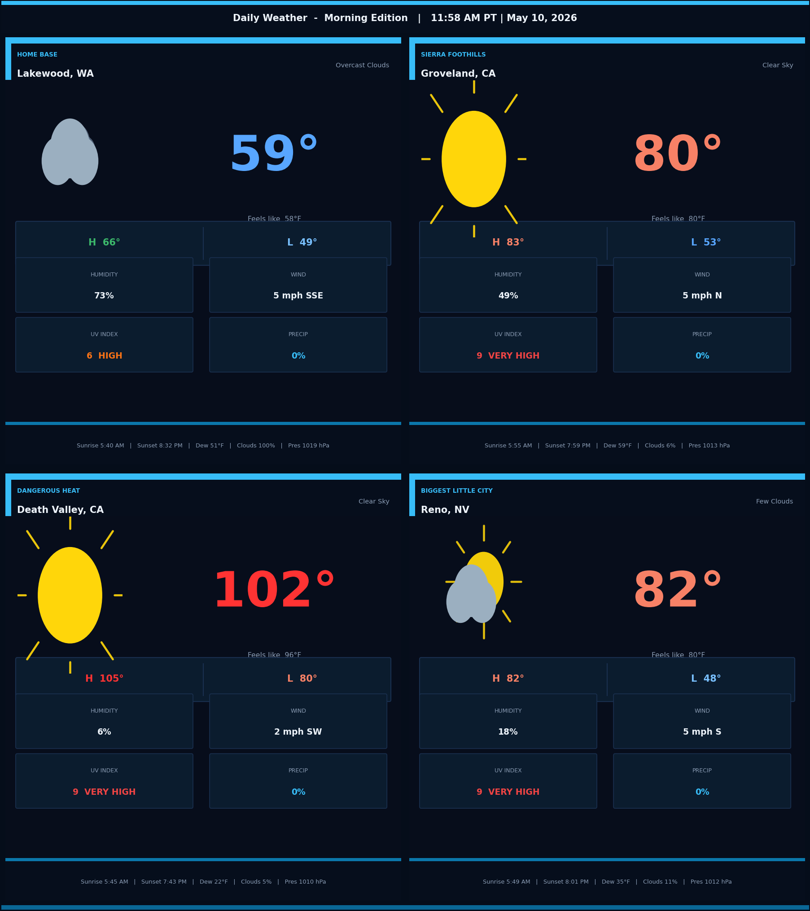
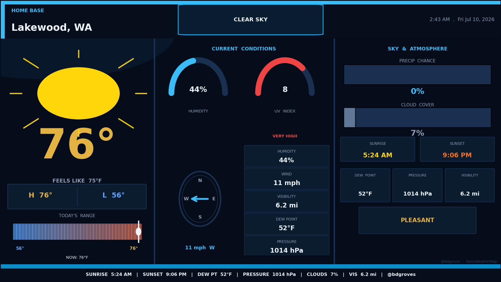
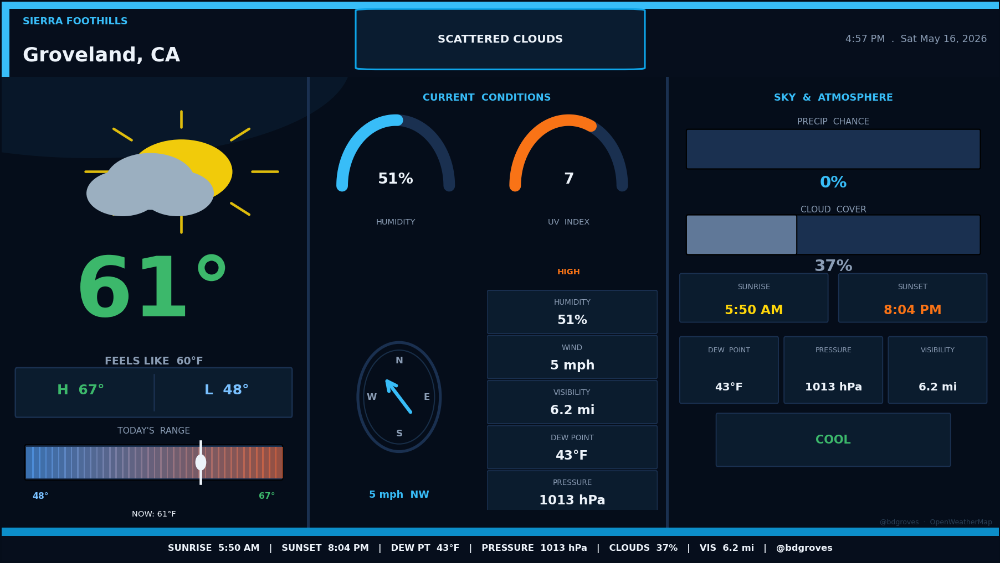
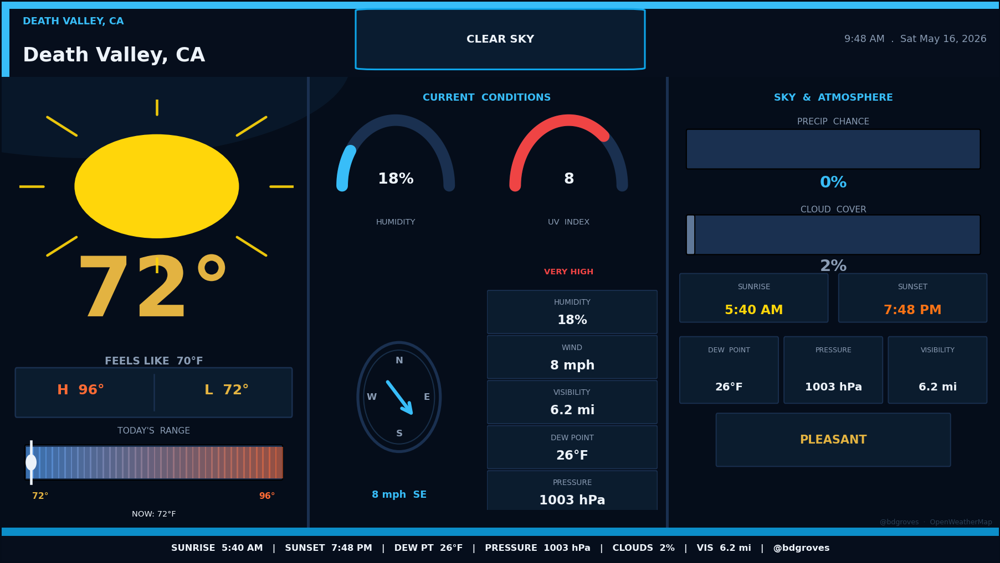
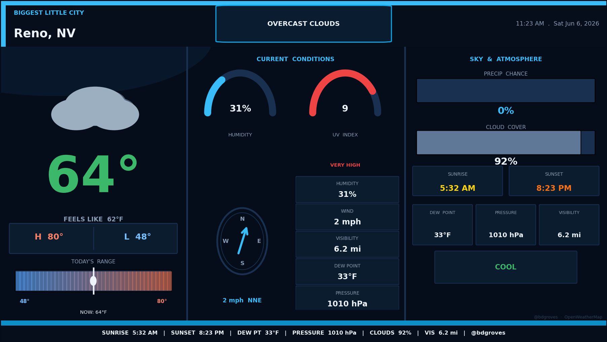

# 🌪️ weather-report-bot

> *"It's already on the ground. It's not gonna stop."*

A fully automated broadcast-quality weather intelligence system. Twice daily it wakes up, pulls live atmospheric data across four wildly different locations, renders cinematic station cards, and fires them to Twitter and BlueSky — no human required.

---

## 📡 The Stations

| Station | Location | Label |
|---|---|---|
| 🏠 | Lakewood, WA | **HOME BASE** — Pacific Northwest maritime climate. Cool, wet, green. |
| 🏔️ | Groveland, CA | **SIERRA FOOTHILLS** — Gateway to Yosemite. Four seasons in one week. |
| 🔥 | Death Valley, CA | **EXTREME CONDITIONS** — Hottest place on Earth. No mercy. |
| 🎰 | Reno, NV | **BIGGEST LITTLE CITY** — High desert. Wind. Dry. |

Four locations. Four completely different air masses. One report.

---

## 📸 Latest Cards

### Combined Report


### Individual Station Cards

| Lakewood, WA | Groveland, CA |
|---|---|
|  |  |

| Death Valley, CA | Reno, NV |
|---|---|
|  |  |

---

## ⚡ How It Works

```
GitHub Actions (7 AM PT / 6 PM PT)
        │
        ▼
  OpenWeatherMap API
  ┌─────────────────────────────────────┐
  │  Current conditions  ·  Forecast    │
  │  UV index  ·  Humidity  ·  Wind     │
  │  Pressure  ·  Dew point  ·  Clouds  │
  └─────────────────────────────────────┘
        │
        ▼
  Matplotlib renderer (pure geometry, no emoji fonts)
  ┌─────────────────────────────────────┐
  │  Broadcast TV-style station cards   │
  │  1200×675 · 16:9 · 150 DPI          │
  │  Weather icons drawn from scratch   │
  │  Temp range bar · Wind compass      │
  │  Arc gauges · Sky & atmosphere      │
  └─────────────────────────────────────┘
        │
        ▼
  Posted to Twitter + BlueSky
  with live data captions & hashtags
```

---

## 🗂️ Project Structure

```
weather-report-bot/
├── src/
│   ├── main.py           # Orchestrator
│   ├── weather.py        # OpenWeatherMap fetcher
│   ├── chart.py          # Broadcast card renderer + post text builder
│   ├── twitter_post.py   # Twitter / X posting
│   └── bluesky_post.py   # BlueSky posting
├── .github/
│   └── workflows/
│       └── weather_report.yml   # Scheduled automation
└── pixi.toml             # Environment & task runner
```

---

## 🛠️ Stack

| Tool | Purpose |
|---|---|
| **Python 3.11+** | Core language |
| **Matplotlib** | Card rendering — every pixel hand-drawn |
| **OpenWeatherMap API** | Live weather data (One Call 3.0) |
| **Tweepy** | Twitter / X v2 API |
| **Requests** | BlueSky AT Protocol |
| **Pixi** | Reproducible environment + task runner |
| **GitHub Actions** | Scheduled automation — no server needed |

---

## 🚀 Running Locally

```powershell
# Install pixi if you haven't
# https://prefix.dev/docs/pixi/overview

# Clone and enter
git clone https://github.com/bdgroves/weather-report-bot
cd weather-report-bot

# Set your API key
$env:OPENWEATHER_API_KEY = "your_key_here"

# Generate cards
pixi run chart

# Post to social (requires Twitter + BlueSky secrets)
pixi run twitter
pixi run bluesky

# Or do everything at once
pixi run all
```

---

## 🔐 Required Secrets

Set these in **GitHub → Settings → Secrets and variables → Actions**:

| Secret | Description |
|---|---|
| `OPENWEATHER_API_KEY` | [openweathermap.org](https://openweathermap.org/api) — One Call 3.0 |
| `TWITTER_API_KEY` | Twitter Developer App — OAuth 1.0a |
| `TWITTER_API_SECRET` | Twitter Developer App |
| `TWITTER_ACCESS_TOKEN` | User access token (Read + Write) |
| `TWITTER_ACCESS_SECRET` | User access token secret |
| `BLUESKY_HANDLE` | e.g. `yourhandle.bsky.social` |
| `BLUESKY_APP_PASSWORD` | BlueSky App Password (not your login password) |

---

## 📅 Schedule

| Run | UTC | Pacific Time |
|---|---|---|
| Morning | `0 15 * * *` | 7:00 AM PT |
| Evening | `0 2 * * *` | 6:00 PM PT |

Or trigger manually from the **Actions** tab anytime.

---

## 🌡️ Card Design

Each station card is a **1200×675 broadcast-style graphic** with three panels:

**Left — Current Conditions**
Big temperature (color-coded by heat level), drawn weather icon, feels like, Hi/Lo box, today's temperature range bar with live position marker.

**Center — Instruments**
Arc gauge for humidity, arc gauge for UV index (color-coded LOW→EXTREME), wind compass with directional arrow, and five KPI boxes (humidity, wind, visibility, dew point, pressure).

**Right — Sky & Atmosphere**
Precipitation chance bar, cloud cover bar, sunrise/sunset times, dew point, pressure, visibility, and current heat label.

**Header:** Station label, city/state, condition badge, live timestamp.
**Ticker:** Sunrise · Sunset · Dew Pt · Pressure · Clouds · Visibility · @bdgroves

---

## 📣 Follow the Reports

- **Twitter/X:** [@bdgroves](https://twitter.com/bdgroves)
- **BlueSky:** [@bdgroves.bsky.social](https://bsky.app/profile/bdgroves.bsky.social)

Hashtags: `#WAwx #CAwx #NVwx #PNWwx #Lakewood #DeathValley #Reno #GrovelandCA #Weather #DailyWeather`

---

*Built with Python, Matplotlib, and a deep appreciation for atmospheric chaos.*
*Data: OpenWeatherMap API · Automation: GitHub Actions*
