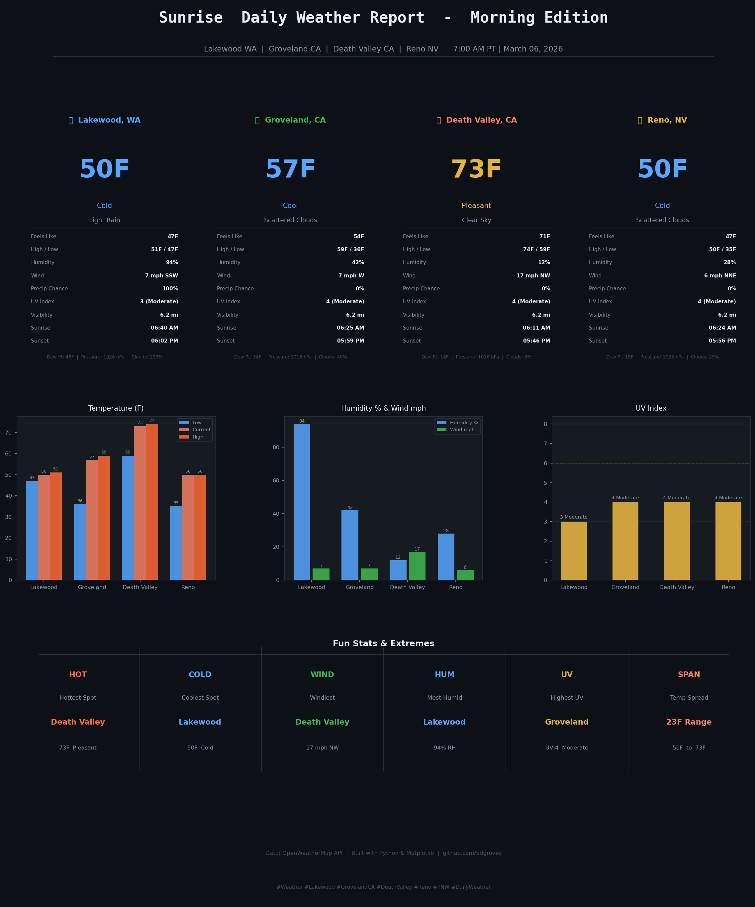

# 🌪️ Weather Report Bot

> *"It's already here."* — Jo Harding, Twister (1996)

[](https://github.com/bdgroves/weather-report-bot/actions/workflows/weather_report.yml)


---

Chasing weather data so you don't have to.

This bot tears through the atmosphere **twice a day** — every morning and evening Pacific Time —
pulling live conditions for four hand-picked locations, generating a clean dark-theme report card,
and launching it straight at Twitter and BlueSky.

No drama. Just data. (OK, maybe a little drama.)

---

## 📡 Latest Report



> Auto-generated twice daily — morning 🌅 and evening 🌆 Pacific Time.
> Posted live to [@bdgroves on Twitter](https://twitter.com/bdgroves) and
> [@bdgroves on BlueSky](https://bsky.app/profile/bdgroves.bsky.social)

---

## 📍 Locations on the Map

| # | Location | Why It's Here |
|---|----------|---------------|
| 🌲 | **Lakewood, WA** | Home base. Where the coffee is strong and the rain is stronger. |
| 🏔️ | **Groveland, CA** | Where it all started. Sierra Nevada foothills, fire season and all. |
| 🔥 | **Death Valley, CA** | Because someone has to watch the most extreme place on Earth. |
| 🎰 | **Reno, NV** | The Biggest Little City. Why not? |

---

## 📊 What's in Every Report
┌─────────────────────────────────────────────────────────────┐
│  CURRENT CONDITIONS                                         │
│  ─────────────────                                          │
│  🌡️  Temperature       Current · High · Low · Feels Like   │
│  💧  Humidity          Relative humidity %                  │
│  💨  Wind              Speed (mph) + Compass direction      │
│  ☀️  UV Index          Index value + Risk label             │
│  🌂  Precipitation     Probability %                        │
│  👁️  Visibility        Miles                               │
│  🌅  Sunrise / Sunset  Local Pacific Time                   │
│  💦  Dew Point         °F                                   │
│  🌡️  Pressure          hPa                                  │
│  ☁️  Cloud Cover       %                                    │
├─────────────────────────────────────────────────────────────┤
│  COMPARISON CHARTS                                          │
│  ──────────────────                                         │
│  📊  Temperature bars  Low · Current · High side by side   │
│  📊  Humidity vs Wind  Head to head across all 4 cities    │
│  📊  UV Index          Color-coded risk comparison          │
├─────────────────────────────────────────────────────────────┤
│  FUN STATS & EXTREMES                                       │
│  ────────────────────                                       │
│  🔥  Hottest Spot      Who is suffering most today         │
│  🧊  Coolest Spot      Who got lucky                       │
│  💨  Windiest          Hang on to your hat                 │
│  💧  Most Humid        The sticky award                    │
│  ☀️  Highest UV        Sunscreen mandatory                 │
│  📏  Temp Spread       Full range low → high               │
└─────────────────────────────────────────────────────────────┘
Copy
---

## 🌪️ The Stack
Weather Data    →   OpenWeatherMap API (2.5 current + forecast)
Chart Engine    →   Python + Matplotlib (dark theme, 150 DPI)
Environment     →   Pixi (conda-forge)
Automation      →   GitHub Actions (cron scheduled)
Social          →   Twitter via Tweepy + BlueSky via AT Protocol
Copy
---

## 🚀 How It Works
Copy     ┌─────────────────────────────────────┐
     │         GitHub Actions              │
     │   7:00 AM PT  ·  6:00 PM PT        │
     └──────────────┬──────────────────────┘
                    │
                    ▼
     ┌─────────────────────────────────────┐
     │         weather.py                  │
     │   Fetches live data for 4 cities    │
     │   via OpenWeatherMap API            │
     └──────────────┬──────────────────────┘
                    │
                    ▼
     ┌─────────────────────────────────────┐
     │          chart.py                   │
     │   Renders dark-theme PNG report     │
     │   KPIs · Bars · Fun Stats           │
     └──────────────┬──────────────────────┘
                    │
           ┌────────┴────────┐
           ▼                 ▼
┌───────────────────┐ ┌───────────────────┐
│   twitter_post.py │ │  bluesky_post.py  │
│   Posts image +   │ │  Posts image +    │
│   tweet text      │ │  post text        │
└───────────────────┘ └───────────────────┘
Copy
---

## 🛠️ Local Setup

### Prerequisites
- [Pixi](https://pixi.sh) installed
- OpenWeatherMap API key (free tier works!)
- Twitter Developer account
- BlueSky account + App Password

### Clone & Install

```bash
git clone git@github.com:bdgroves/weather-report-bot.git
cd weather-report-bot
pixi install
Configure Secrets
bashCopy# Create your local .env (never committed)
cp .env.example .env
# Fill in your keys
envCopyOPENWEATHER_API_KEY=your_key_here
TWITTER_API_KEY=your_key_here
TWITTER_API_SECRET=your_key_here
TWITTER_ACCESS_TOKEN=your_key_here
TWITTER_ACCESS_SECRET=your_key_here
BLUESKY_HANDLE=yourhandle.bsky.social
BLUESKY_APP_PASSWORD=your_app_password
Run Locally
bashCopy# Generate chart only
pixi run chart

# Post to Twitter
pixi run twitter

# Post to BlueSky
pixi run bluesky

# Full pipeline
pixi run all

# Open the chart
pixi run view

⚙️ GitHub Actions Setup
Add these secrets to your repo:
Settings → Secrets and variables → Actions → New repository secret
SecretDescriptionOPENWEATHER_API_KEYOpenWeatherMap API keyTWITTER_API_KEYTwitter/X consumer keyTWITTER_API_SECRETTwitter/X consumer secretTWITTER_ACCESS_TOKENTwitter/X access tokenTWITTER_ACCESS_SECRETTwitter/X access token secretBLUESKY_HANDLEe.g. handle.bsky.socialBLUESKY_APP_PASSWORDBlueSky app password
Schedule
Copy☀️  Morning  →  7:00 AM Pacific Time   (15:00 UTC)
🌆  Evening  →  6:00 PM Pacific Time   (02:00 UTC)

Trigger manually anytime via
Actions → Weather Report Bot → Run workflow


📁 Project Structure
Copyweather-report-bot/
├── .github/
│   └── workflows/
│       └── weather_report.yml   # Scheduled automation
├── src/
│   ├── main.py                  # Orchestrator
│   ├── weather.py               # OWM data fetcher
│   ├── chart.py                 # Matplotlib chart engine
│   ├── twitter_post.py          # Twitter/X poster
│   └── bluesky_post.py          # BlueSky poster
├── assets/
│   └── samples/
│       └── latest_report.png    # Most recent chart
├── .env.example                 # Secret template
├── .gitignore
├── pixi.toml                    # Environment definition
├── pixi.lock                    # Locked dependencies
└── README.md

🌡️ Temperature Color Scale
ColorRangeVibe🔴 #FF2D2D100°F +Get inside🟠 #FF6B3590 – 99°FIt is hot🟧 #F7816680 – 89°FSummer🟡 #E3B34170 – 79°FPerfect🟢 #3FB95060 – 69°FPleasant🔵 #58A6FF50 – 59°FCool💙 #79C0FF32 – 49°FCold🩵 #B0D8FFBelow 32°FFreezing

☀️ UV Index Reference
IndexRisk LevelColor0 – 2Low🟢 Green3 – 5Moderate🟡 Yellow6 – 7High🟠 Orange8 – 10Very High🔴 Red11 +Extreme🟣 Purple

🤝 Contributing
Found a bug? Want to add a location?
PRs welcome. Fork it, branch it, send it.